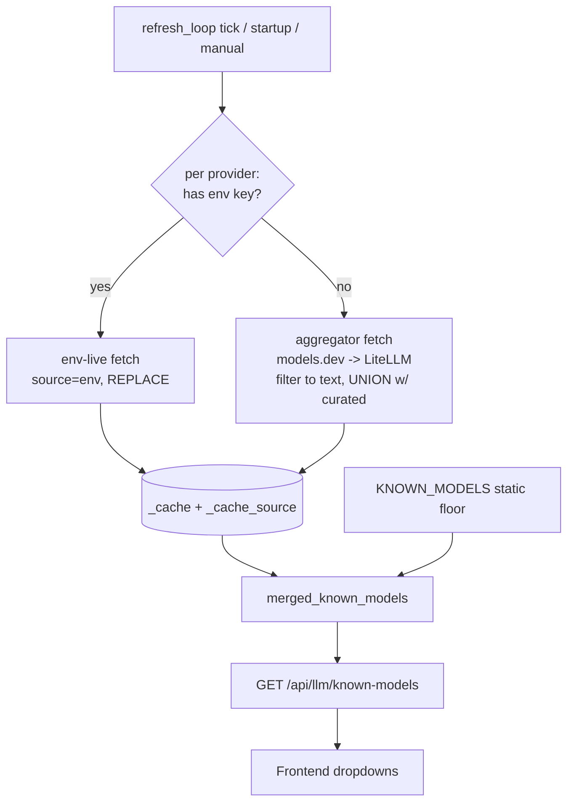

# ✨ Auto-update model catalog from keyless aggregators

## Overview

Keep the LLM model dropdowns current — automatically, with no code change or deploy — for cloud providers the server has **no env-var key** for (and the user hasn't entered a key for). Today those providers fall back to the hand-maintained `KNOWN_MODELS` catalog in `registry.py`, which only changes when a human edits it. This adds a keyless community-aggregator source (models.dev primary, LiteLLM JSON fallback) into the existing periodic refresh, filtered to chat/text models, **unioned over** the curated floor so newly-released models appear within one refresh cycle.

This plan originates from a brainstorm (see brainstorm: `docs/brainstorms/2026-05-27-keyless-model-catalog-brainstorm.md`). Three of its decisions were **refined during planning** based on verified source schemas and a SpecFlow flow analysis — see [Decisions Refined During Planning](#decisions-refined-during-planning). The most important: the merge is a **union** (not replace), and curated context windows are **not** overwritten for known models.

## Problem Statement / Motivation

- **Primary goal (brainstorm):** new models appear fast, no deploy required.
- The v0.11.0 periodic refresh (`model_refresh_service.py`) only refreshes providers that have a **server env key**. On a typical deploy that's a subset (e.g. PROD has OpenAI + Google). Every other provider's dropdown is frozen at whatever `KNOWN_MODELS` shipped.
- The v0.12.0 per-key probe helps a user *who has entered a key*, but does nothing before key entry or for providers they lack a key for.
- No keyless **official** per-provider endpoint exists (OpenAI/Anthropic/Google all require auth to list). A community aggregator is the only keyless option.

## Proposed Solution

Add an **aggregator layer** to the catalog precedence, slotted between the env-live refresh and the curated static floor. It plugs into the one existing merge seam, `merged_known_models()`.

**Catalog precedence per provider (unchanged order, new layer in bold):**

1. User's own key, live fetch (frontend, `ProviderCard`) — only when Settings open + key present.
2. Server env-key live refresh (`_cache`, source=`env`) — only providers in `_providers_with_env_keys()`.
3. **NEW: aggregator (models.dev → LiteLLM), source=`aggregator`** — only providers **without** an env key.
4. Curated `KNOWN_MODELS` floor — always present; never empty.

Layers 2 and 3 are **mutually exclusive per provider per cycle** (env XOR aggregator). Layer 3 **unions** its result with the curated floor; layer 2 keeps its existing replace semantics (it reflects real account access).



## Technical Approach

### Architecture: new module + extend the refresh service

**New file: `backend/app/services/llm/model_catalog_sources.py`** — all aggregator concerns isolated here:
- `fetch_aggregator_catalog() -> dict[LLMProviderType, list[ModelInfo]]` — fetch + parse + filter + map + normalize, with per-provider isolation and last-good behavior delegated to the caller's cache.
- Source adapters: `_fetch_models_dev()`, `_fetch_litellm()` (fallback), each returning a normalized `dict[LLMProviderType, list[ModelInfo]]`.
- `AGGREGATOR_PROVIDER_MAP: dict[str, LLMProviderType]` per source + inverse, and `_normalize_model_id(provider, raw_id)`.
- Filtering helpers (denylist-based).
- Hardcoded source URL constants + `Accept-Encoding: gzip`, descriptive `User-Agent`, timeout, response-size cap.

**Modify `model_refresh_service.py`** — add an aggregator pass to `_refresh_loop`, per-cycle disjoint routing with eviction, provenance tracking, and union merge in `merged_known_models()`.

**Modify `routers/llm.py`** — extend `/api/llm/refresh-status` to report per-provider source provenance (`env`/`aggregator`/`curated`) and per-source health.

No frontend changes required: dropdowns already read `/api/llm/known-models` and `sort_and_enrich_models` already orders curated-first.

### Sources (verified schemas — 2026-05-27)

**models.dev (primary)** — `https://models.dev/api.json`, MIT, ETag/304 supported (Cloudflare).
- Top level keyed by provider id → `{ models: { modelId: {...} } }`.
- Model entry (verbatim sample):
  ```json
  "gpt-4o": {
    "id": "gpt-4o", "name": "OpenAI GPT-4o", "reasoning": false, "tool_call": true,
    "modalities": { "input": ["text","image"], "output": ["text"] },
    "limit": { "context": 128000, "output": 16384 },
    "release_date": "2024-05-13", "knowledge": "2024-05"
  }
  ```
- **Text filter:** keep if `modalities.output` includes `"text"` and does **not** include `"image"` (exclude image-gen output).
- **Context window:** `limit.context`. **Display name:** `name`. **Recency:** `release_date` (used for ordering new models).
- IDs are native (provider from the parent key).

**LiteLLM (fallback)** — `https://raw.githubusercontent.com/BerriAI/litellm/main/model_prices_and_context_window.json`, MIT, ETag/304 supported (~1.47 MB). A bundled `..._backup.json` exists if needed.
- Flat object keyed by model name; **skip the `sample_spec` key**.
- Entry (verbatim): `"gpt-4o": { "litellm_provider": "openai", "mode": "chat", "max_input_tokens": 128000, "max_output_tokens": 4096, ... }`.
- **Text filter:** keep if `mode ∈ {chat, completion}` (denylist the rest: `embedding, image_generation, audio_transcription, audio_speech, moderation, rerank, responses, …`).
- **Context window:** `max_input_tokens` (fallback `max_tokens`). No display name → use the id (curated name applied via enrichment for known ids).
- **Drop routed duplicates:** only keep rows whose `litellm_provider` maps to a native provider in our enum (ignore `azure/`, `bedrock/`, `openrouter/`, etc.).

> Note: the best-practices research recommended LiteLLM *primary* (broadest coverage, cleanest `mode` filter). The brainstorm chose **models.dev primary** (smaller, cleaner, carries `release_date` for "new models fast" ordering) with LiteLLM as fallback — we honor the brainstorm choice. Per-provider fallback (below) gives us most of LiteLLM's coverage anyway.

### Provider-ID reconciliation (highest implementation risk — C1)

Aggregator provider vocab ≠ our enum, and some of our IDs are namespaced.

- **`AGGREGATOR_PROVIDER_MAP`** (explicit, tested) maps each source's provider key → `LLMProviderType`. Examples to handle: `meta` / `meta-llama` / `llama` → `meta_llama`; `x-ai` / `grok` → `xai`; `google` / `vertex_ai` / `gemini` → `google`; `mistral`, `cohere`, `groq`, `openai`, `anthropic` map directly. **Any unmapped source key is ignored, never guessed.**
- **`github_models` is excluded** from aggregator coverage — it re-hosts other vendors under namespaced IDs (`openai/gpt-5.2`); aggregators have no such provider. It falls back to curated. (Documented exclusion.)
- **Model-ID normalization:** our `groq`/`meta_llama` curated IDs are slash-namespaced (`qwen/qwen3-32b`, `meta/llama-4-scout`); LiteLLM keys look like `groq/llama-3.3-70b-versatile`. Normalize so aggregator IDs match curated IDs where they're the same model — otherwise `sort_and_enrich_models` treats them as unknown and the curated name/context window won't apply.

### Merge semantics (the core correctness decision — C5)

`merged_known_models()` must distinguish cache source:
- **source=`env`** → REPLACE the provider's list (real account access is authoritative).
- **source=`aggregator`** → **UNION** with the curated floor: every curated ID survives; aggregator contributes (a) new IDs and (b) context windows for new IDs only. Then run through `sort_and_enrich_models` (curated-first ordering, curated name/context-window enrichment for known IDs).
- No cache entry → curated floor as-is.

Build a fresh merged dict and **swap the reference atomically** so concurrent `/known-models` reads never see a half-built dict (N2).

### Per-cycle disjoint routing + eviction + provenance (C2)

In `_refresh_loop`:
1. Snapshot `env_keyed = set(_providers_with_env_keys())` once.
2. Route each cloud provider to exactly one source: env-keyed → env-live pass; the rest → aggregator pass.
3. **Evict** stale entries when ownership flips: a provider that gained an env key has its `aggregator` cache entry popped; one that lost its key has its `env` entry popped.
4. Track `_cache_source: dict[str, str]` (`env`/`aggregator`) for the status endpoint.
5. **Self-healing for deprecations:** the aggregator contribution is rebuilt from scratch each successful cycle (never unioned with the *previous aggregator* result — only with the *static* curated floor), so models removed upstream disappear (unless curated).
6. **Max stale age:** if every aggregator fetch fails for > 7 days, drop aggregator entries so providers revert cleanly to curated.

### Filtering (denylist, not allowlist — I5)

Prefer a **denylist** of clearly-non-chat categories so unknown *future* model categories default to **visible**, not hidden:
- LiteLLM: drop `mode ∈ {embedding, image_generation, audio_transcription, audio_speech, moderation, rerank}`; keep `chat`/`completion`/unknown.
- models.dev: require `modalities.output` ⊇ `{text}` and exclude entries whose output includes `image` (image-gen). Filter on **output** only (vision-input chat models output text → keep).
- Filtering happens at **ingest, before constructing `ModelInfo`** (which has no modality field — N3).

### HTTP hardening (SSRF + resource safety — C3)

- Source URLs are **hardcoded https constants**, never derived from input (neutralizes SSRF by construction — say so for reviewers).
- **Disable redirect-following** (or re-validate the redirect target against public-IP/https) so a redirect to a private IP can't bypass the check. (`httpx`/`urllib` follow redirects by default.)
- **Timeout** (15s, matching `owl_update_service`) and a **max response-size cap** (LiteLLM is ~1.5 MB and grows; cap ~8 MB to protect the shared box, which already OOMs under memory pressure — see MEMORY).
- **Conditional GET:** persist ETag in module state; send `If-None-Match`; treat `304` as "keep cache." (Resets on process restart — acceptable; N1.)
- `User-Agent: folio-mapper/<version> (+https://openlegalstandard.org)`, `Accept-Encoding: gzip`. Exponential backoff + jitter on retry.
- Follow the proven `owl_update_service` contract: broad `try/except` records status and returns last-good/curated, never propagates.

### New-model ordering (I1)

The brainstorm rejected a separate "New" section (chose plain text filtering). To avoid burying a just-released flagship in the alphabetical "unknown" tail of `sort_and_enrich_models`, sort aggregator-contributed unknown models by **`release_date` descending** within the appended group (models.dev provides it). Newest-first, inline, no separate section.

### Config / env knobs (N4)

Mirror existing patterns: reuse `MODEL_REFRESH_INTERVAL` (86400) + `MODEL_REFRESH_ON_STARTUP` (+15s startup delay). Add an independent kill switch `MODEL_CATALOG_AGGREGATOR_DISABLED` so the aggregator can be turned off without disabling env-key refresh. Optional `MODEL_CATALOG_SOURCE_URLS` override for pinning.

### Implementation Phases

**Phase 1 — Source adapters + filtering + mapping (pure, unit-testable).**
- `model_catalog_sources.py`: fetch (hardened HTTP) + parse + denylist filter + `AGGREGATOR_PROVIDER_MAP` + id normalization → `dict[LLMProviderType, list[ModelInfo]]`.
- Tests against captured sample payloads (no live network in tests).

**Phase 2 — Integrate into refresh service.**
- Aggregator pass in `_refresh_loop`; disjoint routing + eviction + `_cache_source`; union semantics in `merged_known_models()`; atomic swap.
- Tests: union preserves curated, env-flip eviction, both-down → curated, partial success, deprecation self-heal.

**Phase 3 — Observability + polish.**
- `/api/llm/refresh-status` provenance + per-source health; new-model recency ordering; kill switch; docs/MEMORY update.

## Decisions Refined During Planning

These refine/extend brainstorm decisions based on verified schemas + SpecFlow analysis. **Flagged for your review — overridable in the refine step.**

1. **Merge is UNION, not replace** (extends brainstorm "add new IDs"). The existing per-provider replace would drop curated models the aggregator doesn't list/filters out. Union guarantees every curated model survives and makes the filter fail-safe.
2. **Curated context windows win for known models** ⚠️ **(reverses brainstorm decision #6 "fix context windows").** Rationale: `context_window` drives **only** the `(128K)` display label — there is **no cost math** in the codebase (cost estimates come from `/api/llm/pricing` keyed by model ID, `ProviderCard.tsx`). Aggregators mix total/input/output context semantics, so overriding curated values risks *wrong* labels for *zero* functional benefit. Aggregator context windows are used **only for new model IDs**.
3. **`github_models` excluded from aggregator** (new). It re-hosts vendors under namespaced IDs aggregators don't carry; stays on curated.
4. **Denylist filtering** over allowlist (new) — unknown future model categories default to visible, not silently hidden.
5. **models.dev stays primary** despite research suggesting LiteLLM primary — honors the brainstorm choice; per-provider fallback recovers LiteLLM's coverage.

## System-Wide Impact

### Interaction graph
`_refresh_loop` (Timer thread, `asyncio.run`) → env-live pass + aggregator pass → write `_cache`/`_cache_source` → (request path) `GET /api/llm/known-models` → `merged_known_models()` (atomic-swapped dict) → frontend `fetchKnownModels` on app start → `modelsByProvider` (Zustand persist) → `ProviderCard` dropdowns. No callback/observer chain beyond this; no DB.

### Error & failure propagation
All aggregator errors are caught inside `model_catalog_sources` and the refresh pass, recorded as per-provider/per-source status, and degrade to last-good → curated. Nothing propagates to the request path. Matches `owl_update_service` and existing `_refresh_provider` contracts.

### State lifecycle risks
In-memory `_cache` only (no persistence). Risks addressed: env-flip eviction (C2), deprecation self-heal (rebuild-from-scratch), max-stale-age expiry, atomic dict swap to avoid partial reads. No orphaned rows (no DB).

### API surface parity
`GET /api/llm/known-models` (keyless catalog) is the only consumer that changes behavior. The keyed `POST /api/llm/models`, `test-connection`, and `probe-models` paths are unaffected (they use real keys, source of truth per user). `/refresh-status` gains provenance fields (additive).

### Integration test scenarios
See [Test Scenarios](#test-scenarios) — cross-layer cases that mocked unit tests miss (env-flip, partial-source, atomic-swap concurrency, SSRF/hostile-response).

## Acceptance Criteria

### Functional
- [x] A chat model released by a covered keyless provider appears in that provider's dropdown within one refresh cycle (or immediately on restart), with **no code edit**. *(verified live: mistral/anthropic/xai/etc. aggregator-filled)*
- [x] Aggregator data is applied **only** to providers without a server env key; env-keyed providers are unchanged (env-live wins). *(test_env_wins_over_aggregator; live: google=env)*
- [x] **Union preserved:** every curated model ID for a keyless provider remains present after a refresh (e.g. `mistral` keeps `codestral` even if filtered out upstream). *(test_aggregator_unions_with_curated)*
- [x] **No metadata regression:** for any curated model ID, the displayed context-window label after a refresh equals the curated value. *(test_aggregator_does_not_regress_curated_context_window)*
- [x] `github_models` continues to serve its curated namespaced list. *(excluded from provider maps)*
- [x] New aggregator-only models are discoverable without scrolling past all curated entries (recency-sorted within the appended group). *(models.dev sorted by release_date desc; union appends after curated)*

### Non-functional
- [x] No non-text models (embedding/image/audio/TTS/video/moderation/rerank) appear in any dropdown from the new source. *(denylist filter; tests)*
- [x] If **both** sources are unreachable/unparseable, `/known-models` equals the static `KNOWN_MODELS` for every keyless provider, with no error and no empty list. *(test_both_sources_down_falls_back_to_curated)*
- [x] Outbound fetches: hardcoded https URLs, redirects not blindly followed, ≤15s timeout, response-size capped, descriptive User-Agent, gzip. *(_NoRedirect opener, _MAX_BYTES, tests)*
- [x] No added runtime dependency — uses stdlib `urllib` like `owl_update_service`.

### Quality gates
- [x] Unit tests for source parsing/filtering/mapping against captured sample payloads (no live network). *(test_model_catalog_sources.py, 12 tests)*
- [x] Integration tests for the scenarios below. *(test_model_refresh.py, 13 tests)*
- [x] `/api/llm/refresh-status` reports per-provider provenance so operators can confirm the feature is active.
- [x] MEMORY + any user docs updated.

## Test Scenarios

1. **Provider-map round-trip** — every keyless `LLMProviderType` has a tested mapping or is explicitly excluded (`github_models`); unmapped source keys are ignored.
2. **ID normalization** — `groq/llama-3.3-70b-versatile` → matches curated `llama-3.3-70b-versatile` (gets curated name + ctx), not appended as unknown.
3. **Union preserves curated** — aggregator returns 3 mistral models; all curated mistral IDs still present.
4. **No metadata regression** — aggregator returns a curated ID with `context=8000`; displayed ctx stays curated `200000`.
5. **Env-key flip eviction** — aggregator-cache `mistral`; set `MISTRAL_API_KEY`; cycle → entry evicted, source=`env`; unset → reverts to aggregator/curated.
6. **Both sources down → curated** — both fetches raise/timeout; `merged_known_models()` == static `KNOWN_MODELS` for keyless providers; no empty lists.
7. **Partial source success** — models.dev missing `cohere`; filled from LiteLLM (or curated); no provider below its floor.
8. **Denylist filter** — embedding + TTS + unknown-mode chat model → embedding/TTS dropped, unknown-mode **kept**.
9. **SSRF / hostile response** — mocked (a) redirect to `127.0.0.1`, (b) 500 MB body, (c) malformed JSON → each rejected/capped, falls back to curated, no crash.
10. **Deprecation self-heal** — cached aggregator list includes `model-x`; next cycle omits it → `model-x` gone (unless curated).
11. **Ordering** — a new aggregator-only model is discoverable per the recency rule (not silently last).
12. **Concurrency** — repeated `merged_known_models()` reads during a refresh cycle → no `KeyError`/partial dict (validates atomic swap).

## Alternatives Considered (not chosen)

- **CI-synced curated JSON (scheduled Action → PR):** keeps human review, no runtime third-party dependency — but every update is a deploy, failing "fast, no deploy." (Brainstorm-rejected.)
- **Replace semantics for the aggregator layer:** simpler, but silently drops curated models the source omits/filters. Rejected for union.
- **OpenRouter as a third source:** broad + keyless, but no cache headers (no conditional GET), slug reconciliation (`openai/gpt-4o`, `:free`/`:nitro` variants), and ToS (not a license). Deferred — can be added later behind the same source-adapter interface.
- **Overriding curated context windows:** rejected (no cost math; regression risk).

## Risk Analysis & Mitigation

| Risk | Likelihood | Impact | Mitigation |
|---|---|---|---|
| Provider-ID / model-ID mismatch → raw IDs, lost curated metadata | High | High | Explicit tested `AGGREGATOR_PROVIDER_MAP` + id normalizer; ignore unmapped (C1, tests 1–2) |
| Curated models silently dropped | Med | High | Union semantics; test 3 |
| Wrong context-window labels | Med | Low | Curated wins for known IDs; test 4 |
| Upstream schema change / outage | Med | Med | Tolerant parsing, sanity floor, last-good, dual source, curated fallback; tests 6–7 |
| SSRF / OOM from hostile response | Low | High | Hardcoded URLs, no blind redirects, timeout + size cap; test 9 |
| Stale cache after env-key flip / deprecation | Med | Med | Per-cycle disjoint routing + eviction + rebuild-from-scratch + max-stale-age; tests 5, 10 |
| Concurrent read of half-built catalog | Low | Med | Atomic dict swap; test 12 |

## Sources & References

### Origin
- **Brainstorm:** `docs/brainstorms/2026-05-27-keyless-model-catalog-brainstorm.md`. Carried-forward decisions: keyless runtime pull (no deploy); models.dev primary + LiteLLM fallback; auto-filter to chat/text; aggregator only for keyless providers (env-live wins); curated static floor. **Refined here:** union (not replace), curated context windows preserved, `github_models` excluded, denylist filtering.

### Internal references (file:line)
- `backend/app/services/llm/model_refresh_service.py` — `merged_known_models()` (~163–169, the merge seam), `_refresh_provider` (per-provider isolation ~70–88), `_refresh_loop` (`asyncio.run` in Timer thread), env knobs.
- `backend/app/services/llm/registry.py` — `KNOWN_MODELS` (~109), `PROVIDER_ENV_VAR` (~8), `sort_and_enrich_models` (dedup + curated-name/ctx enrichment, curated-first sort).
- `backend/app/services/owl_update_service.py` — keyless GitHub fetch + graceful degradation pattern (UA, 15s timeout, 403 handling, JSON-shape validation; ~89–164).
- `backend/app/models/llm_models.py` — `LLMProviderType` enum, `ModelInfo` (`{id,name,context_window}` — no modality).
- `backend/app/services/llm/url_validator.py` — `validate_base_url()` (per-provider; does **not** cover fixed aggregator URLs — handle separately).
- `backend/app/routers/llm.py` — `/known-models`, `/refresh-status`, `/refresh-models`.
- `packages/ui/src/components/settings/ProviderCard.tsx` — sole consumer of `context_window` (the `(128K)` label); cost label uses `/api/llm/pricing`, not `context_window`.

### External references (verified 2026-05-27)
- models.dev API: https://models.dev/api.json · repo (MIT): https://github.com/sst/models.dev
- LiteLLM JSON: https://raw.githubusercontent.com/BerriAI/litellm/main/model_prices_and_context_window.json · LICENSE (MIT): https://github.com/BerriAI/litellm/blob/main/LICENSE
- OpenRouter models (deferred 3rd source): https://openrouter.ai/docs/guides/overview/models

### Related work
- v0.11.0 periodic model refresh + categorized errors; v0.12.0 per-key model probe (this session). This feature extends the same `model_refresh_service` + `merged_known_models` plumbing.

### AI-era notes
- Schemas verified by direct fetch + header probes (ETag/304 confirmed for models.dev & LiteLLM; OpenRouter has no cache headers). Capture real sample payloads as test fixtures. Given rapid implementation, emphasize the 12 integration scenarios — especially the env-flip, union-preservation, and SSRF cases that mocked unit tests miss.
